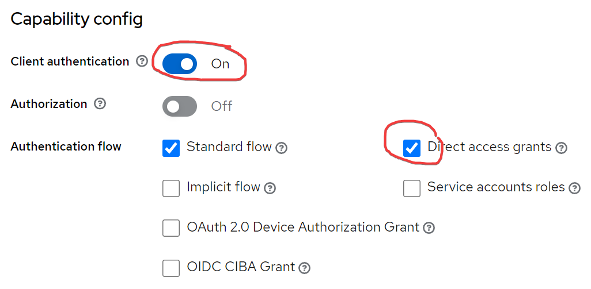
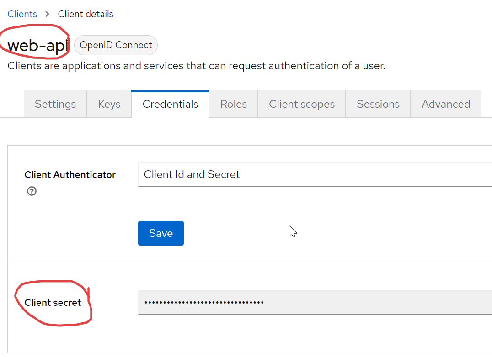

# Keycloak REST API Provider

## Roles management

```csharp
var config = new KeycloakProviderConfig("realmName", "https://some-keycloak-server/realms/realmName",
                                        "someAdminUser", "someAdminPassword",
                                        "admin-cli", "xxxxxxxxxxxxxxx");

var provider = new KeycloakProviderImp(config);

// create new role
await provider.Roles.Create(new KeycloakCreateRole("TestRole"));

// get role by name
var role = await provider.Roles.Get("TestRole");

// update role
await provider.Roles.Update(role.ID,
                            new KeycloakUpdateRole().Name("TestRole New Name")
                                                    .ClientRole(true)
                                                    .Description("Some description"));
// update role attributes
await provider.Roles.UpdateAttributes(role.ID,
                                      new Dictionary<string, string?>()
                                      {
                                         ["attrib1"] = "value1",
                                         ["attrib2"] = "value2",
                                      });
                                               
// delete role
await provider.Roles.Delete(role.ID);

// get realm roles
foreach (var roleItem in await provider.Roles.GetItems())
    Console.WriteLine($"{roleItem.ID}: {roleItem.Name}");

```

## Users management

```csharp
// create user
await provider.Users.Create(new KeycloakCreateUser("a@b.com").Password("123")
                                                             .Attributes(new Dictionary<string, string>()
                                                                         {
                                                                             ["attrib3"] = "value 3",
                                                                             ["attrib4"] = "value 4"
                                                                         }));
// find user by mail
var user = (await provider.Users.Find(true, new KeycloakFindUser(KeycloakFilter.Mail, "a@b.ru"))).First();

// update user with state, password, name and attributes
await provider.Users.Update(user.ID, new KeycloakUpdateUser().Password("456")
                                                             .Name("First name", "Last name")
                                                             .Enabled(true)
                                                             .AddAttribute("attrib5", "value 5"));
                                                             
// get user sessions
foreach(var session in await provider.Users.GetSessions(user.ID))
    Console.WriteLine($"{session.SessionId}: {session.Started}, {session.IPAddress}");

// disable user
await provider.Users.ChangeState(user.ID, false);

// get user groups
foreach(var g in await provider.Users.GetGroups(user.ID))
    Console.WriteLine($"{g.ID}: {g.Name}, {g.Path}");

// delete user
await provider.Users.Delete(user.ID);
```

## Groups management

```csharp
// create group with some attributes
await provider.Groups.Create(new KeycloakCreateGroup("Test group").AddAttribute("attr1", "value1"));

// get group list
var groups = await provider.Groups.GetItems();
foreach (var group in groups)
    Console.WriteLine($"{group.ID}: {group.Name}, {group.Path}");

// update group
var g = groups.First(p => p.Name == "Test group");
await provider.Groups.Update(g.ID, new KeycloakUpdateGroup().AddAttribute("attr2", "value2"));

// update group attributes
await provider.Groups.UpdateAttributes(g.ID, new Dictionary<string, string?>()
                                             {
                                                 ["attr2"] = null,
                                                 ["attr1"] = "new value 1"
                                             });

// delete group
await provider.Groups.Delete(g.ID);
```

## Authenticate via API with Direct Access grants
    
```csharp
var config = new KeycloakProviderAuthConfig("realmName", "https://some-keycloak-server/realms/realmName",
                                            "web-api", "xxxxxxxxxxxxxx"); // client id and secret in realm
var kp = new KeycloakProviderAuthImp(config);
var accessToken = (await kp.GetToken("a@b.com", "12345678")).AccessToken;
```

for authenticate client must be configured with Direct Access grants



Also, take client id and client secret from configuration
